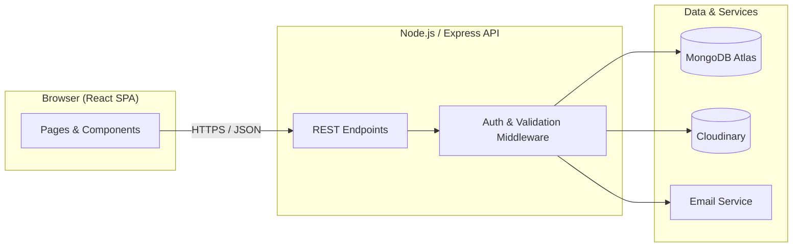
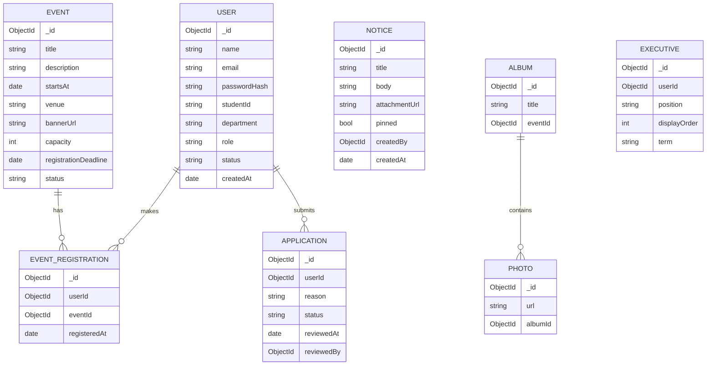

# Technical Requirements Document (TRD)
## NITER Club Website

**Document Version:** 1.0
**Date:** August 10, 2026
**Companion to:** `01-PRD.md`
**Repository:** https://github.com/ashrafularefin78-prog/NITER-CLUB-WEBSITE

---

### 1. Purpose

This document translates the product requirements in `01-PRD.md` into a concrete technical plan: stack, architecture, data model, and APIs. It's the reference for implementation decisions.

> **Assumption:** The stack below (MERN — MongoDB, Express, React, Node.js) is proposed because it's free/open-source end-to-end, widely taught, and well-suited to a small student team. Swap freely if the team already has a preferred stack — the architecture and data model stay valid with any relational or document database.

### 2. Tech Stack

| Layer | Choice | Notes |
|---|---|---|
| Frontend | React (Vite) + Tailwind CSS | Fast dev server, small bundle, utility-first styling |
| Routing | React Router | Client-side routing for the SPA |
| State/data fetching | React Query (TanStack Query) | Caching, loading/error states for API calls |
| Backend | Node.js + Express.js | REST API |
| Database | MongoDB (Atlas free tier) via Mongoose | Document model fits flexible content (events, notices) |
| Auth | JWT (access + refresh tokens), bcrypt for password hashing | Stateless auth, works well with free hosting |
| Image/file storage | Cloudinary (free tier) | Gallery photos, event banners, notice attachments |
| Email | Nodemailer + a transactional provider (Gmail SMTP for low volume, or a free tier like Resend/SendGrid) | Application status, registration confirmations |
| Frontend hosting | Vercel or Netlify (free tier) | CI/CD from GitHub on push |
| Backend hosting | Render or Railway (free tier) | Node API |
| Version control / CI | GitHub + GitHub Actions | Lint/test on pull request |

### 3. System Architecture



- The frontend is a single-page application that talks to the backend exclusively through a versioned REST API (`/api/v1/...`).
- The backend is stateless; every protected request is authenticated via a JWT in the `Authorization` header.
- File uploads (gallery images, banners, notice attachments) go directly from the client to Cloudinary using signed upload requests generated by the backend, so large files never route through the API server.

### 4. Data Model



**Roles** (`User.role`): `member`, `executive`, `admin` (unauthenticated visitors have no record).
**Status values** (`User.status` / `Application.status`): `pending`, `approved`, `rejected`, `active`, `deactivated`.

### 5. API Endpoints (v1)

| Method | Endpoint | Access | Purpose |
|---|---|---|---|
| POST | `/api/v1/auth/register` | Public | Submit membership application (creates pending User + Application) |
| POST | `/api/v1/auth/login` | Public | Log in, returns JWT |
| POST | `/api/v1/auth/refresh` | Authenticated | Refresh access token |
| GET | `/api/v1/events` | Public | List events (filter: upcoming/past) |
| GET | `/api/v1/events/:id` | Public | Event detail |
| POST | `/api/v1/events` | Executive/Admin | Create event |
| PUT | `/api/v1/events/:id` | Executive/Admin | Update event |
| DELETE | `/api/v1/events/:id` | Admin | Delete event |
| POST | `/api/v1/events/:id/register` | Member | Register for an event |
| GET | `/api/v1/events/:id/registrations` | Executive/Admin | List registrants (CSV export) |
| GET | `/api/v1/notices` | Public | List notices |
| POST | `/api/v1/notices` | Executive/Admin | Create notice |
| PUT | `/api/v1/notices/:id` | Executive/Admin | Edit/pin notice |
| GET | `/api/v1/gallery` | Public | List albums |
| POST | `/api/v1/gallery/:albumId/photos` | Executive/Admin | Add photo (via Cloudinary signed upload) |
| GET | `/api/v1/applications` | Admin | List pending applications |
| PUT | `/api/v1/applications/:id` | Admin | Approve/reject application |
| GET | `/api/v1/executives` | Public | List current panel |
| PUT | `/api/v1/executives/:id` | Admin | Update executive listing/order |
| POST | `/api/v1/contact` | Public | Submit contact form (emails admin) |

All list endpoints support `?page=` and `?limit=` pagination.

### 6. Authentication & Authorization

- Passwords hashed with **bcrypt** (cost factor 10+); never stored or logged in plaintext.
- **Access token** (JWT, ~15 min expiry) sent as `Authorization: Bearer <token>`; **refresh token** (httpOnly cookie, ~7 days) used to silently renew it.
- Every protected route is guarded by Express middleware that (1) verifies the JWT and (2) checks the user's `role` against the route's required role — enforced server-side, never trusted from the client.
- Rate limiting (e.g., `express-rate-limit`) on `/auth/*` and `/contact` to blunt brute-force attempts and spam.

### 7. Security Requirements

- All traffic over HTTPS (enforced by the hosting provider).
- Input validation on every write endpoint (e.g., with `zod` or `express-validator`) — never trust client input.
- Sanitize/escape any user-supplied rich text (notices) before storage and render, to prevent stored XSS.
- CORS locked to the deployed frontend origin.
- Environment secrets (DB URI, JWT secret, Cloudinary keys, email credentials) live in environment variables only — never committed to the repo.
- File uploads restricted by type (images/PDF only) and size (e.g., 5MB max) at both the client and the Cloudinary-signature level.

### 8. Performance Requirements

- API responses for list endpoints under 300ms at expected scale (a few thousand users, low concurrent load).
- Images served through Cloudinary's CDN with automatic format/size optimization (`f_auto,q_auto`).
- Frontend code-split by route so the initial bundle stays small.

### 9. Deployment

- `main` branch auto-deploys to production (Vercel for frontend, Render for backend) on push, via the GitHub integration.
- An optional `staging`/`dev` branch for testing before merging to `main`.
- Environment variables configured per environment in the hosting provider's dashboard, not in the repo.

### 10. Suggested Folder Structure

```
NITER-CLUB-WEBSITE/
├── client/                # React frontend
│   ├── src/
│   │   ├── components/
│   │   ├── pages/
│   │   ├── hooks/
│   │   ├── lib/            # API client, helpers
│   │   └── App.jsx
│   └── package.json
├── server/                 # Express backend
│   ├── src/
│   │   ├── models/
│   │   ├── routes/
│   │   ├── controllers/
│   │   ├── middleware/
│   │   └── index.js
│   └── package.json
└── docs/                   # 01-PRD.md, 02-TRD.md, etc. (this folder)
```

### 11. Testing Strategy

- **Unit tests:** controllers and utility functions (Jest).
- **API/integration tests:** key endpoints (auth, event registration) with Supertest against a test database.
- **Manual QA:** critical flows (apply → approve → login → register for event) before each release.
