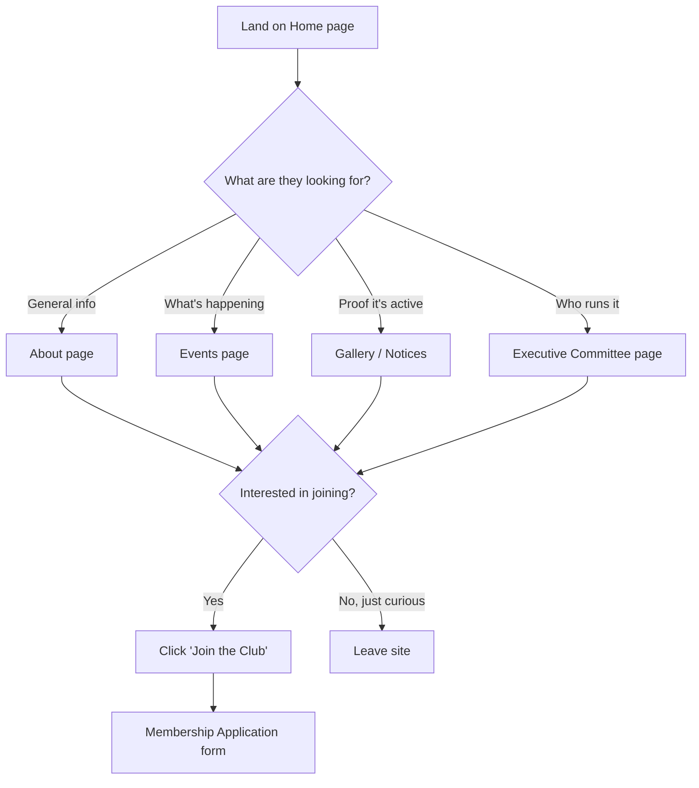
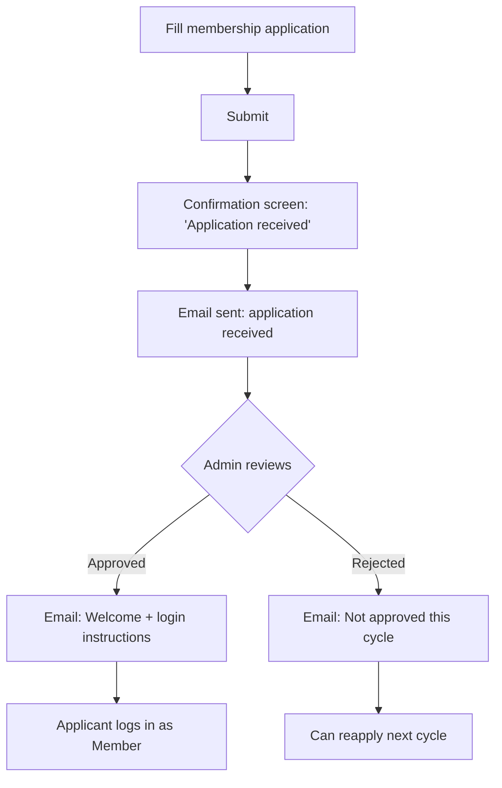
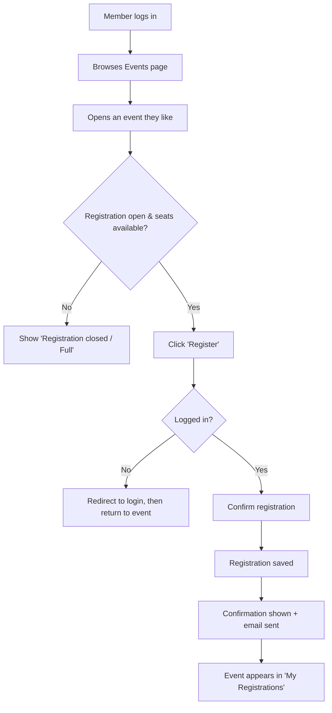
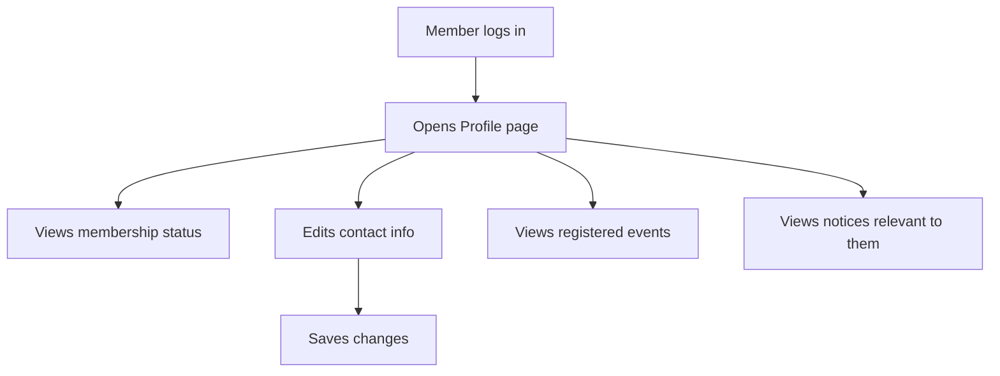
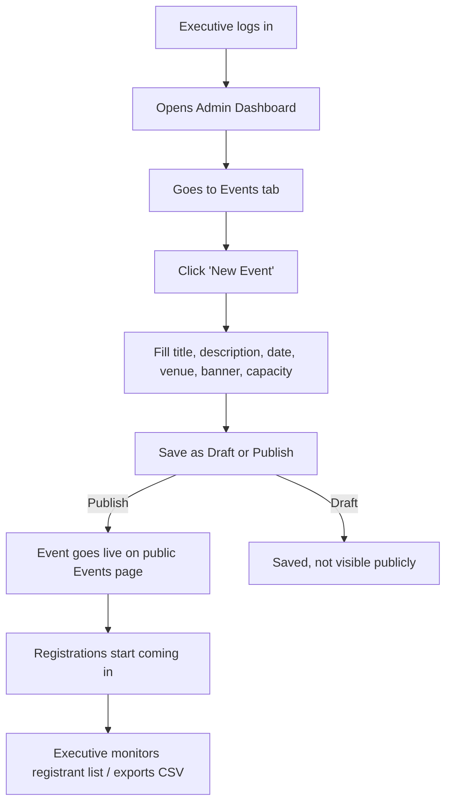
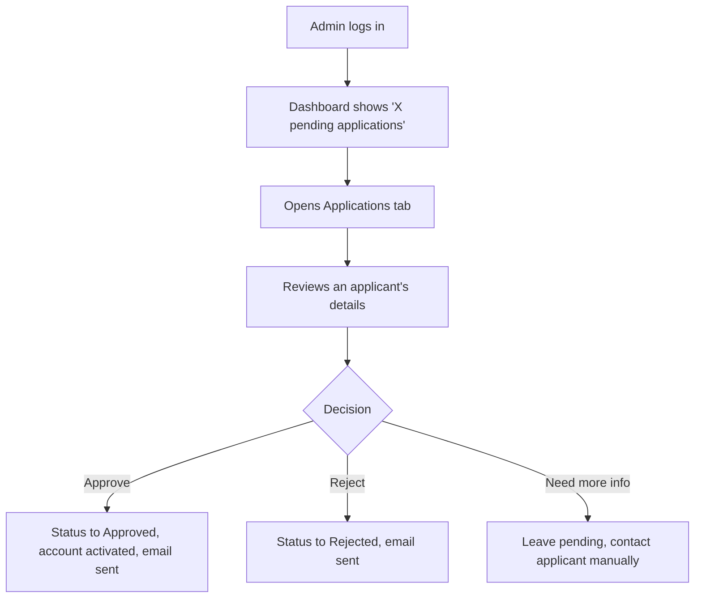
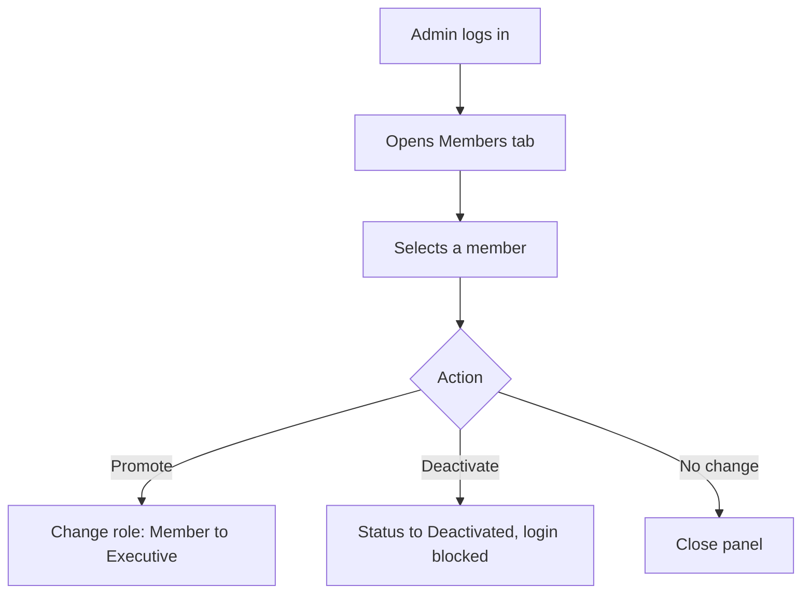

# User Flow
## NITER Club Website

**Document Version:** 1.0
**Date:** August 10, 2026
**Companion to:** `01-PRD.md`, `04-APPLICATION_FLOW.md`

---

### 1. Purpose

This document maps how each type of user moves through the site — what they see, what decisions they make, and where they can get stuck. It complements `04-APPLICATION_FLOW.md`, which covers the underlying technical/system flow for the same journeys.

### 2. Roles Covered

- **Visitor** — anyone not logged in
- **Applicant** — submitted a membership application, awaiting a decision
- **Member** — approved, logged-in student
- **Executive** — committee member with content-management access
- **Admin** — full administrative access

### 3. Visitor Journey — Discovering the Club

### 4. Applicant Journey — Joining the Club

**Edge cases:**
- Duplicate application with the same student ID → rejected at submission with a clear message.
- Applicant never receives the email (spam filter) → a "resend confirmation" option on a status-check page.

### 5. Member Journey — Registering for an Event

### 6. Member Journey — Managing Their Profile

### 7. Executive Journey — Publishing an Event

### 8. Admin Journey — Reviewing Membership Applications

### 9. Admin Journey — Managing Roles

### 10. Cross-Cutting Error & Empty States

| Situation | What the user sees |
|---|---|
| No upcoming events | "No upcoming events right now — check back soon" + link to past events |
| Event full | Disabled "Register" button, "Fully booked" label |
| Not logged in, tries to register | Redirected to login with a "log in to register" message, returned to the event afterward |
| Application already pending | "You already have an application under review" instead of a duplicate form |
| Session expired mid-action | Prompted to log in again; form data preserved where possible |
