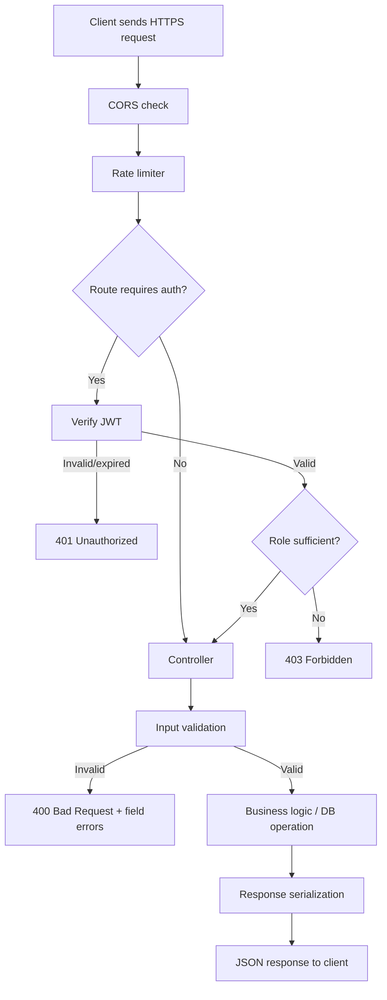
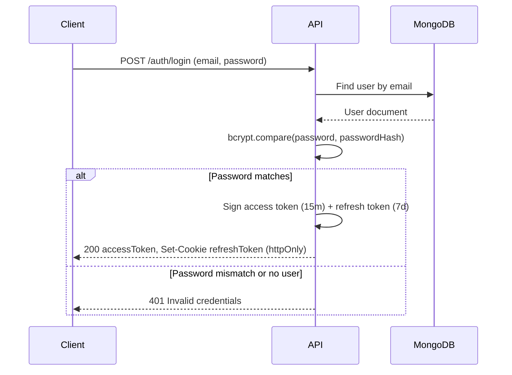
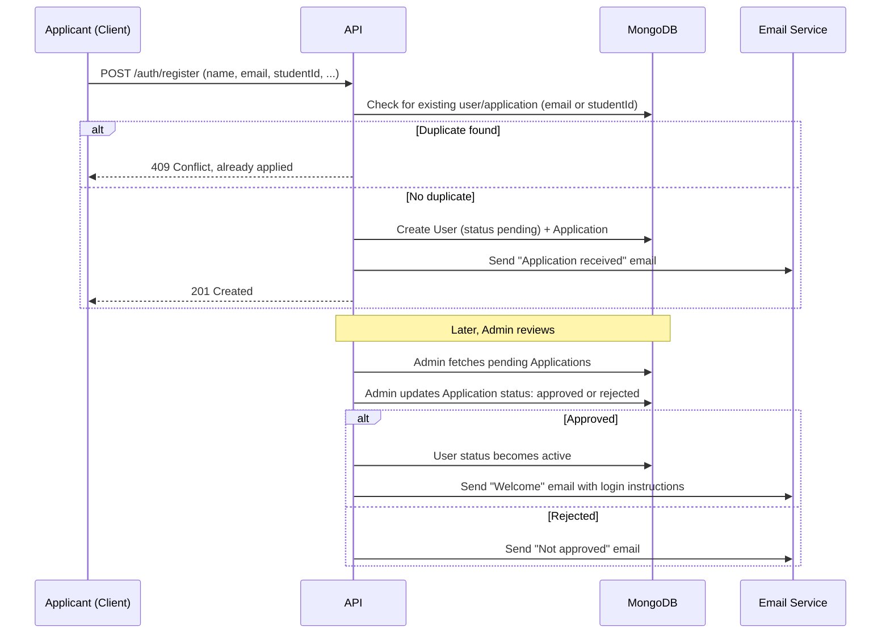
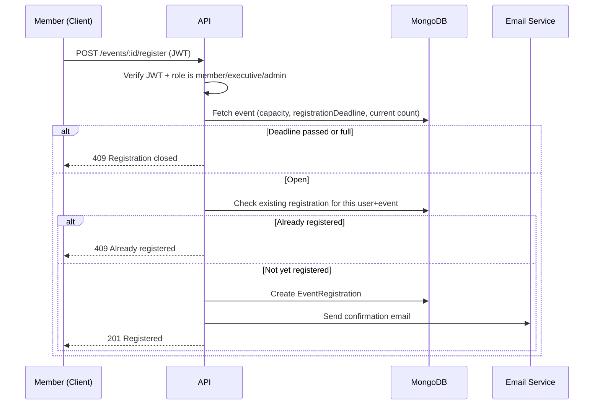
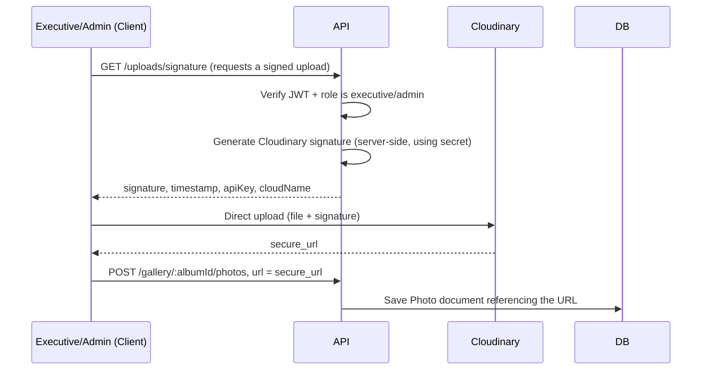
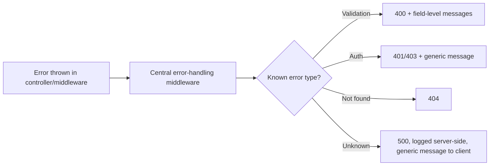

# Application Flow
## NITER Club Website

**Document Version:** 1.0
**Date:** August 10, 2026
**Companion to:** `02-TRD.md`, `03-USERFLOW.md`

---

### 1. Purpose

Where `03-USERFLOW.md` describes what the *person* experiences, this document describes what the *system* does underneath each of those journeys — requests, middleware, database writes, and side effects like emails. Read it alongside `02-TRD.md` for the API and data model it references.

### 2. Request Lifecycle (every API call)

### 3. Authentication Flow (Login)

### 4. Membership Application → Approval Flow

### 5. Event Registration Flow

### 6. Image Upload Flow (Gallery / Event Banner)

This keeps large binary files off the API server entirely — it only ever handles the signature and the resulting URL.

### 7. Frontend Route → Data Flow

| Route | Data fetched on load | Auth required |
|---|---|---|
| `/` | Latest 3 events, latest 3 notices | No |
| `/about` | Static content | No |
| `/events` | Paginated event list | No |
| `/events/:id` | Event detail + registration status (if logged in) | No (register action requires login) |
| `/notices` | Paginated notice list | No |
| `/gallery` | Album list | No |
| `/gallery/:albumId` | Photos in album | No |
| `/contact` | — (form only) | No |
| `/apply` | — (form only) | No |
| `/login` | — (form only) | No |
| `/profile` | Current user + their registrations | Yes (member+) |
| `/dashboard` | Role-appropriate summary (events, notices, applications, members) | Yes (executive/admin) |

### 8. State Management (Frontend)

- **Server state** (events, notices, gallery, applications, members) — managed by React Query: cached, revalidated on window focus, invalidated after mutations (e.g., creating an event invalidates the events list query).
- **Client/UI state** (form inputs, modal open/closed, active tab) — local component state via `useState`; no global store needed at this scale.
- **Auth state** — access token held in memory (React context), refreshed silently via the httpOnly refresh cookie; not persisted to `localStorage`, to reduce XSS token-theft risk.

### 9. Error Handling Pipeline

The frontend's API client catches all non-2xx responses in one place and surfaces a toast/inline error, so individual pages only need to handle the "happy path" plus any field-specific validation messages.

### 10. Notification/Email Touchpoints

| Trigger | Recipient | Channel |
|---|---|---|
| Membership application submitted | Applicant | Email |
| Application approved/rejected | Applicant | Email |
| Event registration confirmed | Member | Email |
| New contact form submission | Admin | Email |
| (Optional v2) Event reminder, 24h before | Registered members | Email |
